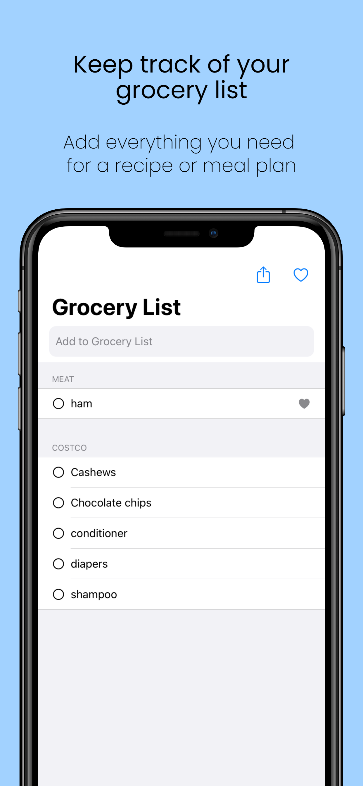
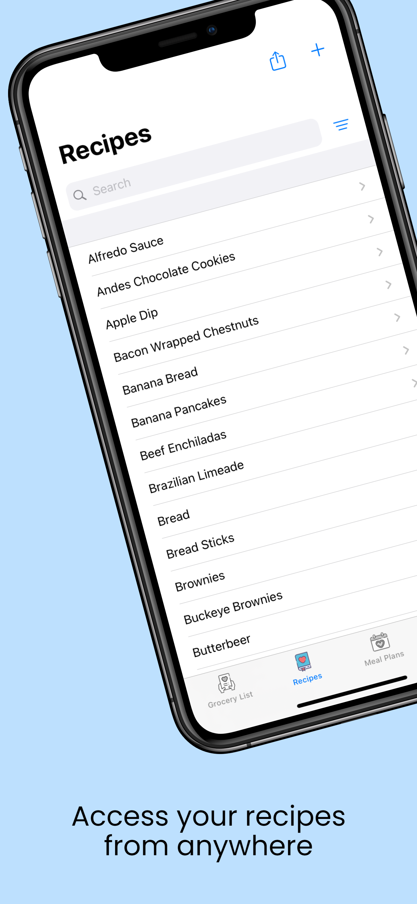
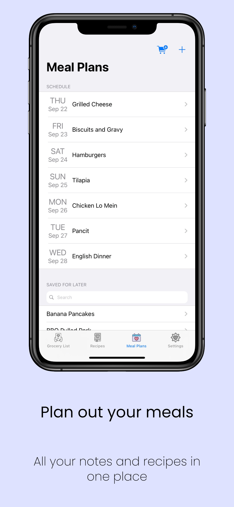
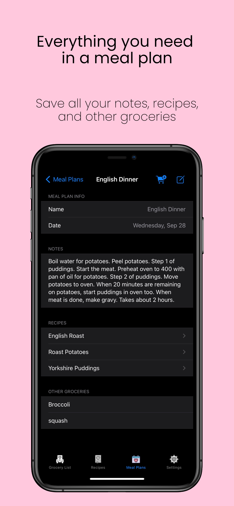
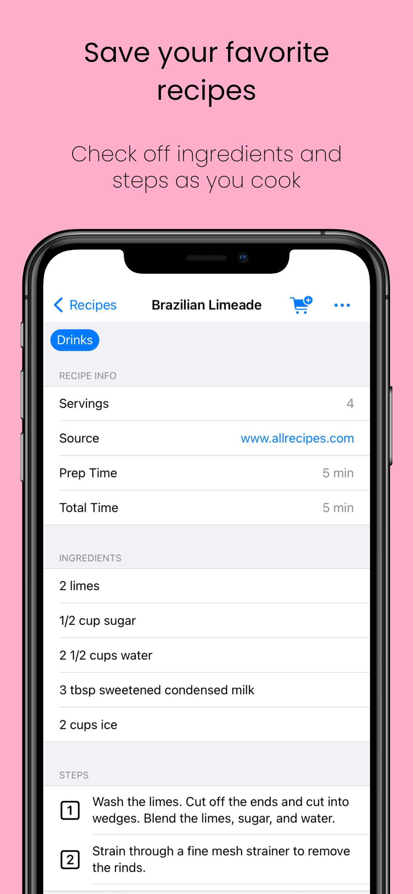

This app was made to track your grocery list, recipes, and meal plans all in one place. It was built to save time and simplify your meal planning and keep your recipes with you any time you need them.

    
    
    
    
    

## Features
- Add your own recipes
- Sort recipes by tags (Dessert, Quick & Easy, Favorites, etc.)
- Share recipes 
- Create reusable meal plans
- Easily add to your grocery list from your meal plan or recipes
- Add items to your grocery list from your Favorites - items you add often
- Sort grocery list into categories to show up in the order you'll shop
- No ads, no subscriptions, no account needed, and no data collected

## Privacy Policy
All information you input into My Food Planner (recipes, meal plans, grocery list) is saved on your own iCloud account to enable syncing between your devices. No data is sent to or collected by the developer. No data is shared or sold to third parties. 

## Contact Us
If you have any questions, feedback, or feature requests, please reach out to <brimco.app@gmail.com>. I'd love to hear from you!
